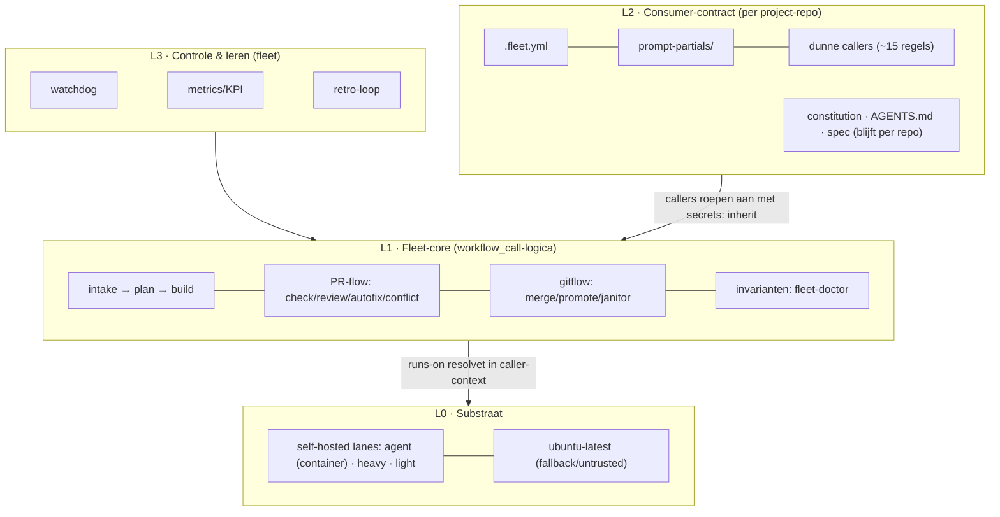
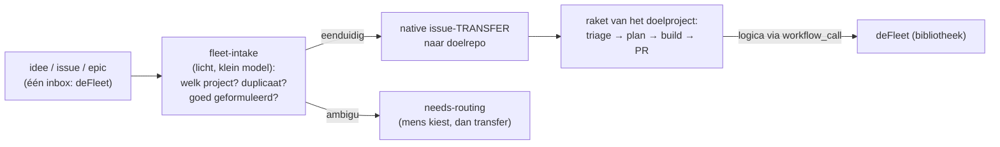

# deFleet-architectuur — de autonome projectbouwer

**Status:** ontwerp v1 (2026-07-27), bijgewerkt (2026-08-04) · geschreven na het bewijs van fase 2
(probe groen op `ubuntu-latest` + `biohack-light`, pick-runner verhuisd, 38 callers live
cross-repo) · fase 4 (tweede consument) is inmiddels gestart, zie §9.
**Scope:** puur de workflow-/runner-machinerie. Wat een consument inhoudelijk bouwt (app, web,
data) is hier bewust een black box achter een contract.

---

## 1. Wat "AI-native" hier betekent

Niet "een CI met een AI-stap erin", maar een systeem waarin **agents de primaire operators zijn**
en mensen alleen verschijnen op echte beslispunten. Zes principes, elk terug te voeren op een
gemeten pijnpunt uit BiohackOS:

| # | Principe | Waarom (gemeten aanleiding) |
|---|---|---|
| P1 | **Elke poort is machine-checkbaar** | Auto-merge draait al maandenlang op 100% success — poorten die een mens *niet* nodig hebben, mogen hem ook nooit vragen |
| P2 | **Menselijke aandacht is de schaarste** | ~⅔ van de merges bleek CI-onderhoud; het doel is dat de eigenaar alleen features/architectuur approvet |
| P3 | **De pijplijn repareert zichzelf** | De watchdog (reconciler-cron) + conflict-solver + autofix bestaan al; het ontwerp maakt zelf-herstel de norm, escalatie (`needs-human`) de uitzondering |
| P4 | **Kosten zijn een routeringsinput** | Sonnet-per-default, override-vars om GitHub-minuten te sparen, 1-slot-wachtrij tot 78 min — model-, runner- en turn-budget horen per taaktype geconfigureerd, niet per incident |
| P5 | **Het systeem meet zichzelf en leert — en meldt zichzelf** | agent-retro/borg-review-lessen bestaan al; elke structurele fix hier begon met een nulmeting (6,2 denials/run, 18,4% max-turns, 30,8% dubbele builds). Een KPI die alleen in een artifact staat, wordt door niemand gelezen — daarom opent de pijplijn nu zelf een issue zodra de denial-ratio van een run de drempel overschrijdt: van passief meten naar actief melden. |
| P6 | **Verhuizen ≠ verbeteren, en één bron van waarheid** | De 4 gedrifte kopieën bij de tweede consument zijn het schrikbeeld; logica leeft één keer, in deze repo |

## 2. Systeemoverzicht — vier lagen



Het dragende mechanisme is fase-2-bewezen: een reusable workflow draait in de **context van de
aanroeper** — diens runners, diens `github.repository`, diens secrets. deFleet levert logica,
consumenten leveren hardware, secrets en domeinkennis.

**De hardste ontwerpregel die daaruit volgt:** fleet-workflows hebben **uitsluitend
`workflow_call`-triggers**. Elke `schedule`/`pull_request`/`issues`/`workflow_run`-trigger leeft
in een **dunne caller** in de consument — een trigger in fleet zelf zou in fleet's eigen context
draaien en geen enkele consument zien. De huidige `[fleet]`-bestanden in BiohackOS dragen hun
triggers nog zelf; elke verhuizing is dus een **splitsing**: logica → fleet, trigger-blok → caller.

## 3. De pijplijn end-to-end — stations en poorten

De RAKET veralgemeniseerd. Per station: wie 'm aftrapt (altijd een caller in de consument), welke
lane, en of er een mens in zit.

| Station | Fleet-workflow (doel) | Trigger (in caller) | Lane | Mens-poort |
|---|---|---|---|---|
| **Intake** | `issue-triage` | issue met takenlabel | agent | nee — labelt, dedupt, escaleert alleen bij twijfel |
| **Plan** | `issue-plan` | triage-akkoord | agent | nee (sinds auto-ontsteking ligt de poort op de PR, niet op het plan) |
| **Build** | `agent-run` (het huidige `claude.yml`) | plan-akkoord / dispatch | agent | nee |
| **PR-hygiëne** | `pr-label`, `pr-check` | pull_request | light | nee |
| **Review** | `pr-review` (scope-classifier + agent-review) | PR-events + `needs-review`-label | light→agent | nee — review is advies, geen poort |
| **Governance** | `feature-governance` | pull_request | light | indirect: `impactanalyse` is required check |
| **Herstel** | `pr-autofix`, `pr-conflict-solver` | workflow_run failure / conflict | agent | nee |
| **Merge** | `auto-merge` | workflow_run groen + review-events | light | **ja, alleen features**: de eigenaar z'n PR-approval; fix/chore/docs/ci mergen op groen |
| **Epic-cadans** | `epic-orchestrator`, `next-ticket-picker` | meerdere aanjagers | light | nee — de fase-PR's dragen de poort |
| **Release** | `promote-release` | dispatch / issue-zijspoor | light | **ja**: production-Environment met required reviewer |
| **Zelfherstel** | `pipeline-watchdog` | schedule (caller) | light | nee — escaleert via `needs-human` |
| **Leren** | `agent-retro`, `review-lessen` | schedule (caller) | agent | nee — output is issues/lessen, geen mutaties |

Drie menselijke poorten in het hele systeem: **feature-approval, release-approval, en
`needs-human`-escalaties**. Al het andere is doorstroom. Dat is de definitie van "autonoom" hier —
niet mensloos, maar mens-op-de-juiste-plek.

## 3b. De poort — vanuit deFleet werken (centrale intake)

**Toevoeging v1.1 (2026-07-27, na de eigenaar z'n verfijning).** deFleet is niet alleen bibliotheek maar ook
**de voordeur**: ideeën, issues en epics schiet je in deFleet in, ongeacht voor welk project ze
zijn. Dit is bewust de éne stations-klasse die in deFleet's **eigen** context draait — intake heeft
per definitie nog geen domeincontext nodig, en deFleet's eigen jobs draaien op `ubuntu-latest`
(repo-scoped runners van consumenten zijn hier onbereikbaar, en dat hoort ook zo).



**De ontwerpregel die de kwaliteit bewaakt: plaats vroeg, werk uit in context.** De verleiding is
om centraal ook te *plannen* — maar een plan zonder constitution/spec/codebase van het doelproject
is per definitie oppervlakkig. Intake doet daarom uitsluitend: (1) doelproject bepalen (klein
routeringsbestand `routing.yml` met per consument trefwoorden/gebieden; bij twijfel
`needs-routing`, nooit gokken), (2) **dedupliceren tegen het doelproject** vóór transfer, (3)
formaat normaliseren (issue- vs epic-sjabloon), (4) **native transfer** — nooit kopiëren, dus geen
dubbele waarheid; GitHub's redirect houdt de historie intact. Uitwerken (trap 2, het plan) gebeurt
daarna in het doelproject, waar de kennis woont.

**Gebouwd en bewezen (M2, 2026-07-28).** De poort draait: `.github/workflows/intake.yml` (uitvoerder,
`ubuntu-latest`), `scripts/intake-decide.sh` (de beslislogica als pure functie, 14 offline tests) en
`routing.yml` (trefwoordtabel). Vier paden live geverifieerd — stuiteren op te vaag (`needs-detail`),
niet-gokken bij ambiguïteit (`needs-routing`), native transfer naar de consument, en zelf-routering
van fleet-infrawerk. Latency 14–21 s. Twee ontwerpkeuzes wijken bewust af van de tekst hieronder:

- **Dedupe is informatief, niet blokkerend.** Stap (2) hieronder blijft staan als intentie, maar de
  poort *blokkeert* er niet op: trap 1 van het doelproject dedupt al mét domeinkennis. Een
  blokkerende dubbel-check op het állereerste station, zónder die kennis, levert vooral
  vals-positieve wrijving op het moment dat een idee nog vaart moet krijgen. De poort zet de
  kandidaten in z'n comment, zodat triage een vliegende start heeft.
- **Zelf-routering doet geen transfer.** Fleet-infrawerk routeert naar deFleet zelf; een
  `gh issue transfer` naar de eigen repo faalt hard. Dat pad eindigt dus met een comment en het
  issue blijft staan.

Eén meevaller: **de bord-hersync bleek gratis.** Een transfer laat bordkoppelingen vallen, maar de
`project-sync` van de consument vuurt op het binnenkomende issue en zet 'm er zelf weer op —
gemeten: `transferred` → `added_to_project_v2` binnen dezelfde seconde. Er is dus geen aparte
sync-stap in de poort nodig.

**Randvoorwaarden en valkuilen die hier expliciet zijn opgevangen:**

- **Label-taxonomie reist niet mee bij transfer** — alleen labels die in de doelrepo bestaan
  overleven. Daarom is de `labels:`-sectie van `.fleet.yml` (§4) niet optioneel maar het
  gedeelde woordenboek: intake labelt uitsluitend met namen die elke consument garandeert.
- **Epics** transferen als het epic-issue; de fase-mechaniek (orchestrator, fase-PR's) is en
  blijft per-repo — de poort raakt die niet aan.
- **Fleet-infra-werk routeert naar deFleet zelf.** Daarmee wordt deFleet z'n éigen eerste extra
  consument (zie roadmap): de eigen issues lopen door dezelfde raket-logica via callers op
  `ubuntu-latest`. Dat is het goedkoopste, veiligste proefkonijn voor het `.fleet.yml`-contract
  dat er bestaat — nul domeinrisico, en het migratiewerk zelf krijgt er de volledige pijplijn
  door.
- **De app is de sleutel.** Transfer + issue-write op meerdere repo's vereist één identiteit die
  op álle betrokken repo's geïnstalleerd is — precies besluit #1 (GitHub App). Zonder de app geen
  poort; dit maakt dat besluit van "aanbevolen" tot **voorwaarde**.
- **Kwaliteitsfilter aan de deur:** een idee dat te vaag is om te routeren of te plannen stuitert
  bij intake — label `needs-detail` + één concrete wedervraag als comment in deFleet. Zo ontvangen
  de rakets van de consumenten uitsluitend welgevormd werk, en ligt de verduidelijkingslus bij de
  poort (goedkoop) in plaats van bij trap 2 (duur).
- **Latency-doel:** intake is secondenwerk (klein model, geen checkout van consumenten) — een idee
  hoort binnen een minuut in de juiste repo te liggen.

**De poort krijgt een stuur: het fleet-cockpit-bord.** Een Projects-v2-bord op user-niveau kan
items uit álle repo's van de eigenaar bevatten — het bestaande BiohackOS-bord ís al user-scoped.
Dat bord wordt het fleet-brede cockpit: elk getransfereerd issue wordt er (opnieuw — transfer laat
bordkoppelingen vallen, dat vangt de sync af) aan toegevoegd door de project-sync van de
consument, en de bestaande Kanban-drive-mechaniek (Status → actie) generaliseert zó dat een
kaart die naar "Nu" schuift de raket van het **eigen** doelproject aftrapt. Vanuit deFleet werken
betekent dan concreet: één inbox (deFleet-issues), één overzicht (het bord, alle projecten), één
stuur (slepen = dispatchen), terwijl elke uitvoering in z'n eigen repo-context blijft. Let op de
al-bekende org-haak: bij een latere org-migratie moet dit bord als org-project opnieuw worden
opgebouwd (open beslissing).

## 4. Het consumer-contract

Wat een project-repo levert om "op de fleet" te draaien:

**`.fleet.yml`** (gevalideerd door de fleet-config-check, met defaults zodat een minimale
consument ~10 regels heeft):

```yaml
# schets — het schema is fase-3-werk
lanes:
  agent: biohack-agent      # label van de agent-lane in DEZE repo
  heavy: biohack-heavy
  light: biohack-light
  fallback: ubuntu-latest
gates:
  feature_approval: true    # features wachten op PR-approval
  release_environment: production
budgets:
  default_model: claude-sonnet-5
  escalation_model: claude-opus-5   # architectuur-/epic-planwerk
  max_turns: {triage: 30, plan: 50, build: 80, review: 40}
labels:                     # de takentaxonomie van deze consument
  task: claude-task
  human: needs-human
```

**`prompt-partials/`** — de domeinkennis die nu hardgecodeerd in de `[shared]`-workflows zit
(bron-hiërarchie, verboden paden, toolchain-aanwijzingen). Fleet-logica checkt de **caller** uit en
leest deze bestanden; fleet levert de skeletten ("je bent de triage-agent, doe X"), de consument
levert het domein ("in dit project geldt constitution.md > spec.md, raak nooit pad Y aan").

**Dunne callers** — één per station, ~15 regels: triggers + `uses: KCTHolman/fleet/...@main` +
`secrets: inherit`. Dit is het enige workflow-bestand dat in de consument leeft.

**Blijft volledig per repo:** constitution, AGENTS.md, spec, domein-workflows (`[biohack]`-bucket:
deploys, domein-crons, release-builds) en de guard-scripts die domeinkennis dragen
(consistency-doctor, spec-drift). Fleet raakt die nooit aan.

**Secrets-contract:** fleet declareert secrets uitsluitend `required: false` met gedocumenteerde
degradatie (het pick-runner-patroon: geen `RUNNER_CHECK_TOKEN` → fallback, nooit stil falen).
Consument geeft alles door via `secrets: inherit`. Fleet-repo zelf bevat **nul** secrets.

## 5. Runner-substraat en capaciteit

> **Showcase-noot.** De concrete capaciteitscijfers, de isolatiestatus per lane en het
> onderhoudsdraaiboek van de host stonden hier oorspronkelijk voluit. Die zijn uit deze publieke
> versie gehaald: ze zeggen niets over het ontwerp, maar wél precies waar een host op dat moment
> zwak stond. Wat overblijft is de vorm van het model — dat is het deel dat overdraagbaar is.

Het substraat bestaat uit drie lanes met elk een eigen karakter:

| Lane | Werk | Isolatievorm |
|---|---|---|
| agent | agent-runs, reviews — verwerkt onvertrouwde tekst | ephemeral container, eigen user, verse registratie per run, geen docker-daemon |
| heavy | builds, tests, migratie-checks | zwaar en langlopend; container-isolatie is hier het einddoel |
| light | git/`gh`-secondenwerk | licht en kort; mag nooit achter zwaar werk wachten |

Ontwerpkeuzes:

- **De agent-lane-vorm is het eindbeeld voor álle lanes**: ephemeral container per job, per-lane
  user, cache-volumes, verse registratie per run. De wrapper-loop + `Dockerfile.{lane}` bestaan al;
  light eerst (kleinste toolchain, laagste risico), heavy laatst (`heavy-2` blijft vangnet).
  **Gemeten valkuil:** een gemount cache-volume is niet automatisch de plek waar de toolchain z'n
  cache zoekt — een SDK-cache die stil naast het gemounte volume schreef in plaats van erin, bleek
  pas op te vallen doordat elke run de cache toch opnieuw opbouwde. De omgevingsvariabele die de
  toolchain naar het gemounte pad wijst, hoort dus met dezelfde stelligheid gezet te worden als het
  volume zelf — een cache-mount zonder die knop is geen cache, alleen schijfruimte.
- **Routering: één beslispunt.** Vandaag zijn er twee mechanismen: pick-runner (availability-check)
  en de `RUNNER_OVERRIDE_*`-vars die 'm kortsluiten (credits-modus). Dat blijft — maar expliciet
  gerangschikt: override-var = kill-switch/kostenmodus, picker = default zodra minuten geen
  schaarste zijn. De picker leest in fase 3 z'n lane-labels uit `.fleet.yml` i.p.v. inputs-per-caller.
- **Multi-consument op één host:** runner-labels zijn repo-scoped; een tweede consument krijgt
  éigen registraties op dezelfde host, of draait volledig op `ubuntu-latest`. Het aantal
  gelijktijdige slots is een RAM-som, geen smaak: elk type build heeft een gemeten piek, en het
  plafond is de som van de worst case — niet het aantal registraties dat je toevallig aanmaakte.
  Nieuwe registratie erbij betekent die som opnieuw maken.
- **Org-migratie blijft de nettere eindtoestand** (gedeelde runner-groups i.p.v.
  per-repo-registraties), maar niets hierboven wacht erop.

## 6. Invarianten en zelf-diagnose — de "fleet-doctor"

De losse guards van vandaag worden één samenhangende, fleet-geleverde suite:

| Invariant (bestaat al als) | Wordt | Draait |
|---|---|---|
| `runner-fleet-assert.yml` — lanes online, labels kloppen | `fleet-doctor` module *runners* | schedule (caller) + na elke registratiewijziging |
| `check-fleet-config.sh` — claude-jobs op agent-lane, geen lane-verspilling | module *routing* (leest `.fleet.yml`) | pr-check van elke consument |
| `branch-protection-assert.yml` — ruleset-drift | module *governance* | schedule |
| `runner-maintenance.sh check` — §7b-onderhoud aanwezig | module *host* (read-only) | `self-hosted host-diagnostics` op dispatch + wekelijks |
| `gitflow-doctor` — zombie-runs, stalls | module *flow* | schedule |
| lessen uit vanavond (nieuw) | module *consistentie*: workflow_run-triggerlijsten matchen bestaande namen; callers wijzen naar bestaande fleet-paden; geen `container:` op agent-lane-jobs | pr-check |

Belangrijk onderscheid: de doctor **rapporteert hard, muteert nooit**. Mutaties (reregistratie,
prunes) blijven bij de watchdog (repo-scope) of owner-assist (host-scope, zie
`self-hosted host-diagnostic-access.md` in BiohackOS). En de les van run 30206695669 blijft wet: diagnostiek
is best-effort, een lege grep mag nooit het rapport afkappen.

## 7. Security-model — drie vertrouwenszones

| Zone | Wat er draait | Regels |
|---|---|---|
| **Untrusted** (PR-/issue-inhoud van buiten de flow) | pr-review, autofix, alles wat vreemde tekst leest | agent-lane-container ÍS de sandbox (geen docker-daemon, geen host-mounts); least-secrets: nooit deploy-/domein-secrets in scope, ook niet via inherit; nooit `pull_request_target` naar self-hosted |
| **Trusted-automatisch** (main-push, schedule, dispatch) | gitflow, orchestrator, watchdog | app-token i.p.v. brede PAT (zie hieronder); job-permissions minimaal |
| **Owner** (host-mutaties, repo-settings, release) | registraties, ruleset, production-approve | uitsluitend de eigenaar, via een apart en expliciet gelogd kanaal — nooit vanuit een workflow |

Drie structurele token-besluiten:

1. **Classic `PROJECT_TOKEN` → GitHub App** (de `workflow-writer`-app bestaat al). App-tokens zijn
   per-repo-scoped, kort-levend, én lossen het vanavond drie keer geraakte **auteur=eigenaar-
   probleem** op: PR's geopend door de app kan de eigenaar gewoon approven; interactieve sessies horen
   via diezelfde app te openen i.p.v. onder de eigenaar z'n eigen token (drie admin-merges vanavond waren
   het gevolg).
2. **Pin-beleid gelaagd:** third-party actions → SHA (audit-blocker, staat nog open); fleet-refs →
   `@main` zolang er één consument is, **SHA/tag zodra de tweede aanhaakt** (vastgelegd in
   het migratielogboek); GitHub-eigen actions → major-tag. **Status:** de tweede consument is
   inmiddels aangehaakt, en het pin-beleid staat sindsdien ook echt aan — fleet-refs draaien op
   een SHA-pin met een nachtelijke bump-job die zichzelf ongepind laat (een kapotte pin mag zijn
   eigen reparatie niet kunnen blokkeren) en pas bumpt nadat de canary (deFleet zelf, op `@main`)
   groen is.
3. **Fleet voegt nooit netwerkbestemmingen toe.** Constitution-grenzen van consumenten (welke
   API's, welke data) zijn per definitie buiten fleet-scope; een fleet-workflow praat alleen met
   GitHub zelf.

## 8. Efficiency-ontwerp — van gemeten lek naar structureel antwoord

| Gemeten lek (nulmeting 2026-07-19) | Structureel antwoord in dit ontwerp |
|---|---|
| 6,2 permission-denials/run, 40-45% herhalingen | Per-station allowlist-profielen in de agent-run-workflow (triage hoeft minder dan build); de ci-agent-gedragslessen verhuizen mee als prompt-partial voor élke consument. **Nieuw:** de ratio wordt niet alleen gemeten maar ook bewaakt — komt hij boven een drempel, dan opent de pijplijn daar zelf een issue over, in plaats van te wachten tot iemand toevallig de KPI-log opent |
| 18,4% `error_max_turns` | Turn-budget per taaktype in `.fleet.yml` (`budgets.max_turns`); retro bewaakt de verhouding budget↔faalkans per station |
| 30,8% dubbele builds | Concurrency-groepen op subject (issue/PR), gestandaardiseerd in de fleet-skeletten — nooit meer per workflow uitgevonden |
| Wachtrij tot 78 min op 1-slot-lane | Agent-lane heeft nu 2 slots; picker + override als capaciteitsregelaar; KPI bewaakt wachttijd |
| Auto-merge ↔ workflow_run **naam**-koppeling (beet vanavond bij de rename) | De triggerlijsten zijn caller-bestanden (consument), de doctor-module *consistentie* bewaakt naam↔lijst; optioneel later: één verzamel-"gate"-check zodat auto-merge op één naam luistert |
| Rerun = oude YAML-snapshot (kostte vanavond bijna een verkeerde architectuurkeuze) | Vast diagnostiek-principe in de watchdog: nooit een fix verifiëren via `gh run rerun`; altijd verse trigger na `update-branch` |
| Model-kosten | Routering in `.fleet.yml`: sonnet default, opus alleen voor plan-/architectuurstations; de review-scope-classifier (bestaat) bepaalt of een review überhaupt draait |

**KPI-set** (nachtelijke metrics-workflow per consument, artifact + wekelijkse retro-issue):
denials/run · max-turns-ratio · dubbele builds · wachttijd per lane · mens-poort-latency (hoe lang
wacht een feature-PR op approval) · kosten per gemergde PR. De laatste twee zijn de échte
autonomie-metrieken: dalen die, dan wordt het systeem zelfstandiger.

## 9. Migratie-roadmap (vervolg op fase 2)

**Fase 2-rest — de overige `[fleet]`-workflows, klein → groot, elk als splitsing (logica → fleet,
trigger-caller → consument):**

| Volgorde | Workflow | Risico | Opmerking |
|---|---|---|---|
| 1 | `self-hosted host-diagnostics` | nul | dispatch-only, geen afhankelijkheden |
| 2 | `runner-fleet-assert` | laag | eerste schedule-caller-splitsing als patroonbewijs |
| 3 | `branch-protection-assert`, `gitflow-doctor`, `branch-janitor`, `cleanup-merged` | laag | hygiëne-groep |
| 4 | `release-storage-cleanup`, `issue-release`, `agent-track` | laag | |
| 5 | `promote-release` | midden | raakt de production-Environment-poort — verifieer de approval-flow expliciet |
| 6 | `auto-merge` | **hoog** | de spine (100% success): pas verhuizen als de doctor-module *consistentie* draait; één-op-één, geen verbeteringen |

**Fase 2½ — de poort (nieuw, uit de v1.1-verfijning):** (a) GitHub App installeren op fleet +
BiohackOS (besluit #1, nu voorwaarde); (b) `routing.yml` + fleet-intake-workflow in deFleet's
eigen context (`ubuntu-latest`), met dedupe-tegen-doelrepo, `needs-detail`-stuiter en native
transfer; (c) issue-/epic-sjablonen in deFleet gespiegeld aan de raket-sjablonen; (d) het
user-bord als cockpit: project-sync van de consument voegt getransfereerde issues (opnieuw) toe.
Validatie: één echt idee end-to-end — deFleet-issue → transfer → BiohackOS-raket → gemergde PR —
zonder handmatige stap behalve de bestaande poorten. **deFleet wordt hier meteen z'n eigen eerste
extra consument**: fleet-infra-issues routeren naar deFleet zelf en lopen door dezelfde
raket-logica via callers op `ubuntu-latest` — het veiligste proefkonijn voor het contract dat er
bestaat.

**Fase 3 — parametrisering van `[shared]` (18):** eerst het `.fleet.yml`-schema + validator, dan
één pilot (`pr-label`: kleinste prompt-oppervlak), dan de PR-flow-groep, dan de raket-stations, en
**`agent-run`/`claude.yml` als allerlaatste** (grootste bestand, elf afnemers). Elke stap: consument
draait één week op de fleet-versie naast ongewijzigd gedrag vóór de volgende.

**Fase 4 — Tweede consument als validatie: inmiddels gestart, niet meer alleen een plan.** Een
tweede project — andere taal, andere stack, volledig op `ubuntu-latest`, geen self-hosted
host-claim — is aangehaakt met een minimale `.fleet.yml` en de eerste dunne callers. Succescriterium
blijft: de complete raket zonder één regel fleet-logica te forken, en de eerste stap (een
zuivere gitflow-workflow zonder projectkennis) staat er al. Dit is ook het moment van het
SHA-pin-besluit — zie §7.2, dat besluit is genomen en staat aan.

**Fase 5 — org + runner-groups** (besluit ligt bij de eigenaar; haken in het migratielogboek). **Fase 6 —
nazorg:** oude paden opruimen, lessen → retro.

## 10. Openstaande besluiten (voor de eigenaar, met aanbeveling)

1. **GitHub App als identiteit voor álle geautomatiseerde én interactieve PR's + de poort** —
   status verzwaard van "aanbevolen" naar **voorwaarde** (fase 2½): zonder app geen
   cross-repo-transfer, en 'ie lost tegelijk de approval-flow (auteur=eigenaar) en de
   classic-PAT-blocker op.
2. **Moment van org-migratie** — aanbevolen: pas ná fase 4; de tweede consument op ubuntu bewijst eerst
   dat het zonder kan.
3. **Verzamel-"gate"-check voor auto-merge** (één check-naam i.p.v. naam-lijsten) — aanbevolen:
   ja, maar pas bij de auto-merge-verhuizing zelf (stap 6), niet eerder — spine niet twee keer
   aanraken.
4. **Lanes containeriseren (light/heavy)** — aanbevolen: light in het volgende onderhoudsvenster
   (draaiboek bestaat), heavy pas na een maand stabiel light.
5. **KPI-dashboard-locatie** — artifact-per-run is genoeg om te starten; pas bij bewezen gebruik
   iets bouwen (geen nieuwe bestemmingen).

---

*Wijzigingsbeleid van dit document: dit is de kaart, het interne migratielogboek is de status. Wie
een fase uitvoert, werkt het plan bij en laat dit document alleen aanpassen als het ontwerp zelf
wijzigt — met de reden erbij.*
