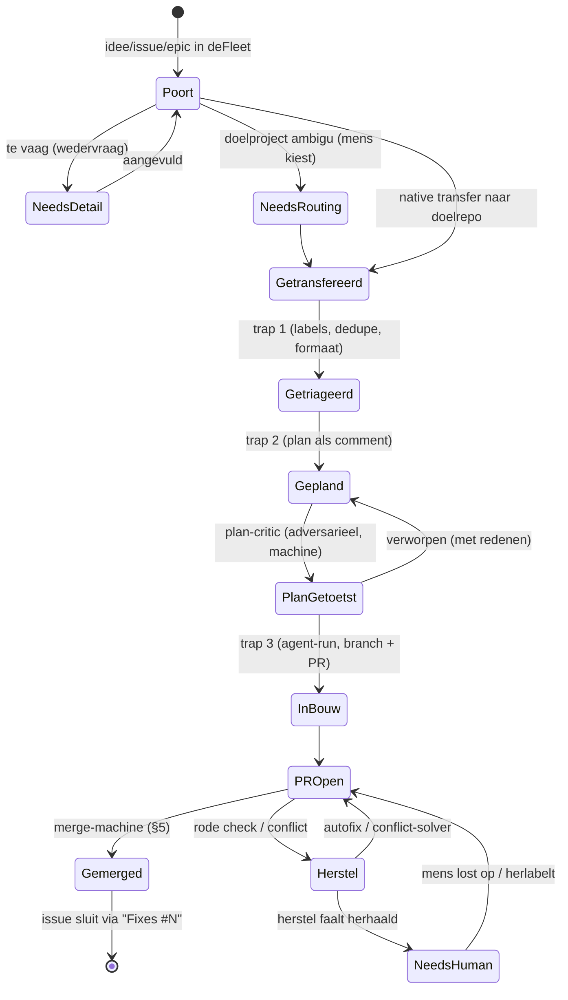

# De gitflow in detail — werkstroomspecificatie

**Status:** v1 (2026-07-27) · operationele laag onder [architectuur.md](architectuur.md) (de kaart)
en naast het interne migratielogboek (het logboek).
**Leesregel:** dit document beschrijft de flow zoals 'ie **hoort** te lopen, met per onderdeel het
kwaliteitsanker en het faalpad. De genummerde invarianten (§11) zijn de machine-checkbare
destillatie — die voedt de fleet-doctor. Onderdelen gemarkeerd **[opwaardering]** zijn bewuste
niveauverhogingen t.o.v. de huidige werking — de rest beschrijft wat er al draait.

---

## 0. Besturingsfilosofie — reconciler-first **[opwaardering]**

De fundamenteelste zwakte van de huidige flow: de besturing hangt aan **events** (`workflow_run`
op namen, label-events, review-events), met de watchdog als pleister voor alles wat GitHub laat
vallen. Events raken zoek, matchen op namen (beet ons bij de rename), triggeren niet op
bot-acties (anti-recursie) en racen met elkaar. Het gemeten gevolg: drie redundante aanjagers per
overgang en een watchdog die "gaten dicht".

Het hogere ontwerp draait dat om — het controller-patroon:

1. **De gewenste volgende actie is altijd afleidbaar uit observeerbare staat** (labels,
   PR-status, check-conclusies, branch-bestaan). Nooit uit "welk event kwam er binnen".
2. **De reconciler is de motor, niet het vangnet.** Eén loop per consument leest de staat en
   trapt idempotent de volgende overgang af. De bestaande watchdog *is* deze motor in embryo —
   hij wordt gepromoveerd, niet vervangen.
3. **Events zijn versnellers.** Een `workflow_run`-/label-/review-event mag een overgang eerder
   laten gebeuren; het mag nooit de enige weg zijn. Valt een event weg, dan is het enige verlies
   latentie (max. één reconciler-cadans), nooit correctheid.
4. **Eén schrijver per subject.** Alle aanjagers van hetzelfde issue/PR delen één
   concurrency-groep; de reconciler claimt die groep net zo goed als het snelle pad.

Consequentie voor alles hieronder: elke overgang in §2–§6 moet **staat-afleidbaar + idempotent**
zijn (I17/I18). De naam-koppeling van `workflow_run` degradeert daarmee van
correctheidsvoorwaarde naar optimalisatie — precies waar 'ie thuishoort.

## 1. Branch- en besturingsmodel

| Branch | Rol | In | Uit |
|---|---|---|---|
| `main` | default + integratie | elke PR (squash) | promotie naar `release` |
| `release` | productie | alleen promotie vanaf `main`, achter de production-Environment-poort | deploy/release-artefacten |
| `lab` | speeltuin autonome sporen | experimenten | **nooit** automatische promotie |

Regels die alles dragen:

- **Eén issue = één PR.** Vertak van `main`, richt op `main`. Squash-merge met branch-delete —
  dus **nooit een branch stapelen op een nog-niet-gemergde branch** zonder het besef dat je na
  diens squash moet rebasen met `--onto` op de squash-SHA (zie draaiboek §10.4).
- **De conventional-commit-PR-titel is een besturingssignaal, geen decoratie.** Er hangen drie
  machines aan: de release-bump (release-logica leest het type), de governance-poort
  (`feat` → GOVERNANCE-blok verplicht; `fix/chore/docs/ci/refactor/test` slaan automatisch over)
  en de merge-route (feature wacht op approval, de rest merget op groen). Daarom is `open-pr.sh`
  de enige gesanctioneerde opening — geen stille fallback op branchnaam of template.
- **Ruleset op `main`** (geverifieerd 2026-07-27): geen deletion/non-FF; 1 approving review +
  code-owner; required checks zijn **job-contexten** — `impactanalyse`, `PR check gate`,
  `consistency-doctor`. Job-contexten overleven workflow-renames; hernoem je ooit een **job**,
  dan is dat een ruleset-wijziging (owner) in dezelfde beweging.
- **PR-auteur ≠ approver.** GitHub weigert self-approval; de eigenaar kan alleen approven wat een
  ándere identiteit opende. Daarom opent de machinerie (en straks ook interactieve sessies) PR's
  onder de app-identiteit — de drie admin-merges van 2026-07-27 waren het gemeten gevolg van dit
  niet doen.

## 2. De issue-levenscyclus als toestandsmachine

Toestand leeft in **labels + PR-status**, nergens anders — geen schaduwadministratie. De
watchdog mag elke toestand aflezen en elke pijl opnieuw aantrappen; hij mag nooit een toestand
*verzinnen*.

**Kwaliteitsankers per overgang:** de poort stuitert vaag werk (goedkoopste moment); triage
dedupt tegen de doelrepo; het plan is een comment op het issue (reviewbaar, maar sinds de
auto-ontsteking geen mens-poort — de mens-poort ligt op de PR); "Fixes #N" in de PR-body is
verplicht voor de sluitketen (§6 voor de epic-variant, de gemeten valkuil).

## 3. Stations in detail

Per station: trigger (altijd in de consument), lane, concurrency-sleutel, en het faalpad. De
GitHub-`permissions` per station: minimaal, per job — de tabel noemt alleen de write-rechten.

### 3.1 Raket

| | Trap 1 · triage | Trap 2 · plan | Trap 3 · agent-run |
|---|---|---|---|
| Trigger | issue gelabeld (takenlabel) | triage-akkoord | plan aanwezig / dispatch |
| Lane | agent | agent | agent |
| Concurrency | per issue | per issue | per issue (dubbele-run-slot: de tweede wacht, annuleert nooit lopend werk) |
| Writes | issues | issues | contents/PR/issues |
| Turn-budget | klein | midden | groot (het `budgets.max_turns`-contract, §4 architectuur) |
| Faalpad | `needs-human` + reden als comment | idem | max-turns/denial → watchdog herdispatcht met vers budget; 2× gefaald → `needs-human` |
| Kwaliteitsanker | dedupe + welgevormdheid | plan noemt geraakte bestanden/specs expliciet | preflight vóór elke commit; verifieer wat je raakt, niet meer |

**Agent-gedragscontract** (verhuisd als prompt-partial naar élke consument, want gemeten
turn-lekken): losse bash-commando's (compound faalt op de matcher), een geweigerde tool-call
nooit herhalen, geen achtergrond-subagents open laten staan bij het einde van de run.

**De plan-critic [opwaardering].** Sinds de auto-ontsteking (mens-poort van plan naar PR
verschoven) passeert een plan **ongelezen** naar de bouw — het enige station zonder enige
toets, terwijl een slecht plan het duurste faalpad is (volledige build + review + herstel op
het verkeerde fundament). Daarom krijgt trap 2 een machine-poort: een **tweede, adversariële
agent-pass** (klein model, eigen prompt: "verwerp dit plan") die het plan toetst op precies
vier dingen — (1) genoemde bestanden/specs bestaan echt, (2) geen conflict met
constitution/spec van de consument, (3) scope past bij het issue (geen sluipende verbreding),
(4) het plan noemt z'n eigen verificatie (welke tests bewijzen dit straks). Verworpen =
concrete redenen als comment → trap 2 herziet; twee keer verworpen → `needs-human`. Dit is
bewust een goedkope poort op het goedkope moment — het spiegelbeeld van de `needs-detail`-
stuiter aan de voordeur (I19).

### 3.2 PR-flow

| Station | Trigger | Lane | Kern | Faalpad |
|---|---|---|---|---|
| `pr-label` | PR open/sync | light | type-/area-/size-labels uit titel + diff | label-drift → project-sync herstelt |
| `pr-check` | PR open/sync | light → per-area-suites | classificeert de diff en draait **alleen** de geraakte suites (app → flutter; web → node; ci → shell-tests); aggregeert in de required check **`PR check gate`** | rood = blokkade; autofix mag proberen |
| `feature-governance` | PR open/sync | light | `feat` → GOVERNANCE-blok verplicht (required check **`impactanalyse`**); overige types passeren automatisch | ontbrekend blok = rood, geen uitzonderingen |
| `pr-review` | PR open/reopen/ready/`needs-review`-label | light (classify) → agent (review) | scope-classifier beslist óf en met welke focus (app/web) gereviewd wordt; `skip-review`-label respecteren; review is **advies met een noodrem** (zie onder) | review-*storing* mag een merge nooit blokkeren; metrics als artifact |
| `pr-autofix` | workflow_run: PR-check rood | agent | kleine herstelcommits op de PR-branch | niet-triviaal → stoppen, comment, `needs-human` |
| `pr-conflict-solver` | conflict gedetecteerd (watchdog/event) | agent | rebase/merge-herstel op de PR-branch | onoplosbaar → `needs-human` |

**Reviewbeleid = kostenbeleid:** de classifier bepaalt model en noodzaak (docs-/ci-only kan
overslaan). Dat is de gemeten kostenreductie-lijn; kwaliteitscompensatie zit in de required
checks + borg-review-lessen (§8).

**Review met een noodrem [opwaardering].** Vandaag is de review zuiver advies: een gevonden
datalek-achtige fout en een stijl-nit wegen even zwaar (niets). Het hogere ontwerp maakt het
verdict **gestructureerde data** i.p.v. proza: de review eindigt in `{advies[] , blockers[]}`.
Advies blijft advies. Maar één of meer `blockers` (concreet: aantoonbare dataverlies-/security-/
crash-paden, met faal-scenario) zetten het label `review-blocker` → de merge-machine behandelt
de PR als feature (wacht op mens) tot het label weg is. De rem is smal gedefinieerd en
adversarieel geformuleerd ("alleen wat je kunt bewijzen"), zodat 'ie zeldzaam blijft — de
KPI bewaakt de vals-positief-ratio; storing in de review zelf trekt nooit aan de rem (I20).

### 3.3 Merge & gitflow-hygiëne

Zie §5 (merge-machine). Eromheen: `cleanup-merged` (branch weg na merge), `branch-janitor`
(stale branches), `gitflow-doctor` (zombie-runs, vergeten toestanden — poll-gebaseerd, bewust
geen workflow_run-web), `branch-protection-assert` (ruleset-drift is een alarm, geen mening).

### 3.4 Release

| Stap | Wat | Poort |
|---|---|---|
| bump | release-logica leidt versie af uit gemergde PR-titels | — |
| build | domein-workflow van de consument (`[biohack] Release`) | groene build |
| promotie | `promote-release`: `main` → `release` | **production-Environment met required reviewer** — dit is mens-poort #2 en blijft per consument geconfigureerd |
| nazorg | storage-cleanup, artefactrotatie | — |

**Fleet-grens:** fleet levert de promotie-/opruimlogica; het bouwen zelf (Flutter/web/wat dan
ook) is en blijft domein.

### 3.5 Zelfherstel & leren

| Station | Cadans | Mandaat |
|---|---|---|
| `pipeline-watchdog` (reconciler) | elke N min (caller-schedule) | mag herdispatchen, conflict-solver aftrappen, doorstroom herstellen; mag **nooit** poorten passeren of toestanden verzinnen; escaleert met bewijs naar `needs-human` |
| `gitflow-doctor` | schedule | rapporteert; opent hoogstens chore-issues |
| `agent-retro` / `review-lessen` | nacht/week | destilleert lessen → issues/prompt-partial-updates; sluit de leerlus van P5 |
| `fleet-doctor` (nieuw, §11) | pr-check + schedule | draait de invariantenlijst; hard rapporteren, nooit muteren |

## 4. Nachtvenster en cadans

De autonome sporen starten 's nachts (scheduler-caller ~05:00 UTC) — bewust vóór de menselijke
ochtend, ná de domein-crons. Cadansregels:

1. **Crons stapelen niet:** elke schedule-caller krijgt een eigen minuut-offset; twee zware jobs
   op hetzelfde tijdstip op dezelfde lane is een ontwerpfout, geen pech.
2. **De watchdog is de metronoom overdag** — hij vult gaten (gemiste events) op; schedules zijn
   voor batchwerk, niet voor doorstroom.
3. **Nachtwerk is bij uitstek agent-lane-werk:** de mens-poorten zijn 's nachts dicht (feature-PR's
   wachten gewoon tot de ochtend), dus de nacht produceert PR's en lessen, geen merges van
   feature-werk — fix/chore merget wél gewoon door (P1).

## 5. De merge-machine in detail

De spine. Gemeten 100% success — elke wijziging hier is per definitie hoog-risico en gaat
één-op-één (verhuizen ≠ verbeteren).

**Groen-definitie:** de vereiste checks (`PR check gate`, `impactanalyse`, `consistency-doctor`)
geslaagd; `SKIPPED` telt als "nog niet klaar", nooit als groen — het volgende event herbeoordeelt.

**Aanjagers — geherordend volgens §0 [opwaardering]:**
1. **de reconciler** — het gegarandeerde pad: leest per open PR de staat (checks groen? type?
   approval? `review-blocker`?) en merget idempotent wat mergebaar is;
2. `workflow_run` op groene PR-check/governance — versneller (seconden i.p.v. cadans);
3. `pull_request_review` (approval) — versneller voor het feature-pad.

Functioneel identiek aan vandaag (de watchdog dóét dit al als "vangnet") — het verschil is het
contract: bij het wegvallen van élk event blijft de flow correct, alleen trager. Dat maakt
naam-hernoemingen, bot-label-anti-recursie en event-races van correctheidsrisico's tot
latentie-voetnoten.

**Routing op PR-type (uit de titel):**

| Type | Route |
|---|---|
| `fix` `chore` `docs` `ci` `refactor` `test` | merge op groen, geen mens |
| `feat` (incl. epic-fasen) | wacht op approval van de eigenaar (mens-poort #1) |
| alles | squash + branch-delete; titel wordt de squash-subject |

**Race-preventie:** één concurrency-groep per PR-branch over álle aanjagers heen — de gemeten
fout was een groep die branch-naam en PR-nummer mengde waardoor twee aanjagers parallel
`gh pr merge` probeerden.

**De naam-koppeling (les 2026-07-27):** de `workflow_run:`-triggerlijsten matchen op
workflow-**namen**. Die lijsten leven in caller-bestanden; invariant I7 bewaakt dat elke naam in
zo'n lijst bestaat. En de PR die de rename zelf doorvoert kan per definitie niet via het snelle
pad mergen — dat is geen bug maar een bekende eigenschap: approval-pad of watchdog vangt 'm.

## 6. Epics — de fase-cadans

- **Structuur:** epic-issue (het contract) → fase-issues → fase-PR's. De orchestrator bewaakt de
  volgorde; een vervolg-fase leest eerst de daadwerkelijk gemergde vorige fase-PR (niet het plan —
  het plan liegt soms, de merge nooit).
- **De twee gemeten stall-oorzaken zijn invarianten geworden:**
  - fase-PR verwijst met **`Fixes #<fase-issue>`** — een verwijzing naar het epic-nummer laat het
    fase-issue open en de orchestrator eeuwig wachten (I8);
  - bot-gezette labels triggeren geen vervolg-workflows (GitHub's anti-recursie) — elke
    label-gedreven overgang heeft daarom een tweede aanjager nodig (watchdog of schedule) (I9).
- **Fase-PR's zijn features:** elke fase passeert de approval-poort. Een epic is dus autonoom
  *tussen* de poorten, nooit erlangs.

## 7. Self-hosted substraat — capaciteitsmodel en degradatie

> **Showcase-noot.** De concrete cijfers van de host (RAM, schijf, welke diensten er náást de
> runners draaien) stonden hier oorspronkelijk voluit. Die zijn uit deze publieke versie gehaald:
> ze horen bij één specifieke machine en zeggen niets over het model. De capaciteitsregels
> hieronder zijn wél het overdraagbare deel.

| Lane | Vorm | Werk |
|---|---|---|
| agent | ephemeral container, eigen user, verse registratie per run | agent-runs, reviews |
| heavy | langlopend; container-isolatie is het einddoel | builds, tests, migratie-drift |
| light | kort en licht | git/`gh`-secondenwerk |

**Capaciteitsregels:**

1. **Het wrapper-/service-aantal is het plafond, niet het aantal registraties.** Een extra
   registratie erbij vereist eerst de RAM-som opnieuw: de worst case is alle lanes tegelijk op
   piek plus wat er verder op de host draait. Wie dat overslaat, ontdekt het plafond via de
   OOM-killer in plaats van via een som.
2. **Maximaal één zware build tegelijk is het doel, twee het plafond** — de dubbele-builds-KPI
   (30,8% nulmeting) bewaakt dit; concurrency-groepen op subject zijn het mechanisme.
3. **RAM-piek wordt gemeten, niet aangenomen:** `self-hosted host-diagnostics` krijgt een
   piek-sampling-sectie zodat de budgetten hierboven metingen worden (open punt).
4. **Multi-consument claimt niet automatisch de host:** een nieuwe consument start op
   `ubuntu-latest` (model van de tweede consument); self-hosted host-registraties voor een tweede repo zijn een
   bewuste capaciteitsbeslissing van de eigenaar.

**Routeringsmodi (expliciet, want vandaag actief):**

| Modus | Mechanisme | Wanneer |
|---|---|---|
| **Override** (actueel) | `RUNNER_OVERRIDE_*`-vars pinnen de lane, pick-jobs skippen | GitHub-minuten schaars; volledige controle, geen fallback |
| **Picker** (default-ontwerp) | fleet-`pick-runner`: availability-check, busy telt niet mee, fallback `ubuntu-latest`, trusted-context-gate | zodra minuten geen schaarste zijn |

**De afweging die bij override hoort, hardop:** de picker's trusted-context-gate (PR-events →
fallback) staat in override-modus **uit** — PR-jobs draaien dan direct op de lanes. Dat is
verdedigbaar zolang álle PR's van de eigenaar zelf komen en de lane die onvertrouwde inhoud
verwerkt gecontaineriseerd is. Structureel opgeheven zodra elke lane in een container draait.

**En precies dáár zit de les die deze showcase-repo bestaansrecht geeft.** Zo'n afweging hangt aan
een aanname over de *zichtbaarheid* van de repo — "er komen hier geen PR's van vreemden". Die
aanname is geen eigenschap van de code; hij is een eigenschap van één instelling die je met twee
muisklikken omzet. Wordt de repo publiek, dan is de mitigatie stil verdwenen zonder dat er één
regel veranderde, en niets in de pijplijn merkt dat op.

Vandaar de regel die in deze publieke repo machinaal wordt gehandhaafd door
[`scripts/check-no-triggers.sh`](../scripts/check-no-triggers.sh): **geen enkele workflow hier
heeft een eigen trigger.** Niet "een veilige trigger" — géén. Wat niet kan vuren, hoeft geen
aanname over zichtbaarheid te dragen.

**Degradatiemodi:**

| Scenario | Gedrag | Wie merkt het |
|---|---|---|
| self-hosted host offline, picker-modus | alles valt terug op `ubuntu-latest`; domein-deploys stallen | watchdog meldt; deploys wachten op host |
| self-hosted host offline, override-modus | jobs queuen onzichtbaar op het label | **zwakte van override** — de fleet-doctor runners-module moet dit melden (I11) |
| agent-lane vol | tweede run wacht in z'n concurrency-slot; wachttijd-KPI bewaakt | retro |
| host-onderhoud | venster: lanes één voor één (`heavy-2` als laatste vangnet); containerized lanes zijn per definitie leeg te laten lopen (ephemeral) | eigenaar + log in `self-hosted host-diagnostic-access.md §6` |

**Host-onderhoud, staand:** §7b-laag (work-cleanup-cron, journal-vacuum, GRADLE_USER_HOME) is
geïnstalleerd en wordt door `runner-maintenance.sh check` bewaakt; `disableupdate` op de vier
bare-metal-registraties is het nog openstaande onderhoudsvenster-item; docker-prune hoort bij de
image-bouwcyclus van de containerlanes.

## 8. Het kwaliteitsstelsel — poorten-matrix

Welke faalklasse wordt door wélk mechanisme gestopt (hard) of gezien (advies):

| Faalklasse | Mechanisme | Hard/advies |
|---|---|---|
| kapotte code/tests | `PR check gate` (alleen geraakte suites) | **hard** (required) |
| feature zonder impactanalyse | `impactanalyse` | **hard** (required) |
| registry/spec/CI-drift | `consistency-doctor` | **hard** (required; advies-bevindingen blokkeren niet) |
| slechte titel (breekt bump/governance/merge) | title-lint + `open-pr.sh` | **hard** bij openen |
| inhoudelijke zwakte | agent-review | advies — bewust geen poort |
| verkeerde lane / claude buiten agent-lane | fleet-config-check + lane-scan | **hard** in pr-check |
| runner-/host-drift | runner-fleet-assert · maintenance-check · diagnostics | melding/issue |
| gitflow-toestand vergeten | gitflow-doctor + watchdog | zelfherstel, dan `needs-human` |
| terugkerende reviewfouten | borg-review-lessen → prompt-partials | leerlus |
| architectuurgrens overschreden | constitution/AGENTS per consument + preflight-reminders | mens + agent-contract |

Plus de twee mens-poorten (feature-approval, release-approval) en `needs-human` als universeel
stopcontact. **Ontwerpprincipe:** elk incident eindigt óf in een invariant (I-lijst), óf in een
prompt-partial-les, óf in een bewuste geaccepteerde-risico-notitie — nooit in alleen een gefixte
symptoom.

## 9. Security-overlay per station

| Station | Zone | Secrets in scope | Noot |
|---|---|---|---|
| poort/intake (deFleet) | trusted-automatisch | app-token (issues) | leest ongefilterde ideeën → prompt-injection-bewust, maar kán niets muteren buiten issues |
| triage/plan/build | untrusted-inhoud | OAuth-token agent, app-token | agent-lane-container = sandbox; geen docker-daemon; geen domein-secrets |
| pr-check/governance | untrusted-code (bij override direct op lanes) | geen | zie I10-afweging §7 |
| review/autofix/conflict | untrusted-inhoud | OAuth + PR-write | bot-auteur-allowlist expliciet, geen `*` |
| merge/gitflow | trusted | app-token (contents/PR) | de spine draait zonder domein-secrets |
| release-promotie | owner | environment-gebonden | required reviewer is de poort |
| watchdog/doctor | trusted | app-token (dispatch) | mag aanjagen, niet passeren |
| host | owner | geen GitHub-secrets op de host-route | SSH-route bewust nooit vanuit Actions |

Token-eindbeeld: **één GitHub App** voor alle machinerie-identiteit (per-repo installatie,
kortlevende tokens), `RUNNER_CHECK_TOKEN` (admin:read) per consument voor de picker, OAuth-token
per consument voor de agent-runtime. Classic PAT's: uitfaseren (openstaande audit-blocker).

## 10. Storingsdraaiboek (symptoom → check → herstel)

1. **Run faalt in "Set up job" met docker-/containerfouten op de agent-lane** → de job-YAML vraagt
   een geneste `container:` (verboden op deze lane, I5) — verwijder 'm; de lane-container ís de
   sandbox.
2. **Fix gemerged maar dezelfde failure blijft** → check of je naar een **rerun** kijkt: reruns
   spelen de oude YAML-snapshot af. Nooit een fix verifiëren met `gh run rerun`; forceer een verse
   trigger (`gh pr update-branch` + label/reopen).
3. **PR-runs heten opeens naar hun bestandspad en falen direct** → de merge-ref is onbouwbaar
   (conflict) of de workflow parset niet; los het conflict/de syntax op — de runs zelf zeggen hier
   niets over de inhoud.
4. **Conflict op een branch die op een gemergde branch was gestapeld** → `git rebase --onto
   origin/main <sha-van-de-gemergde-commit> <branch>` (de branch-ref is na squash+delete weg;
   gebruik de SHA) — force-push met lease.
5. **PR groen maar merget niet** → (a) feature zonder approval? (b) auteur=eigenaar (self-approval
   onmogelijk — app-identiteit gebruiken of admin-merge met notitie)? (c) workflow_run-gap na een
   rename — let op: dat is niet alleen een vergeten naam maar óók een ongeëscaped glob-teken in een
   naam die er wél goed uitziet (punt 13)? (d) anders: watchdog-run afwachten of handmatig aanjagen.
6. **Issue "af" maar blijft open / orchestrator wacht eeuwig** → PR-body verwijst naar het
   epic-nummer i.p.v. `Fixes #<fase-issue>` (I8) — issue handmatig sluiten + body-les.
7. **Jobs queuen onzichtbaar** → override-modus + lane offline (I11): host checken
   (`self-hosted host-diagnostics`), of tijdelijk override-var leeg → fallback.
8. **Agent-run sterft direct op turn 1 op de agent-lane** → sessie-/slotconflict: check of beide
   containers gezond zijn en of er geen tweede run in dezelfde concurrency-groep hangt.
9. **Host-schijf/RAM-alarm** → `self-hosted host-diagnostics` (read-only) eerst; mutaties via het
   gelogde sudo-kanaal, nooit vanuit een workflow.
10. **Een meerdelige check stopt na z'n eerste bevinding** (module 2 van 3 draait nooit, het
    eindoordeel ontbreekt) → GitHub's bash-default is `-eo pipefail`, en een eigen
    `set -uo pipefail` in het script zet die `-e` **niet** uit. Zet expliciet
    `shell: bash --noprofile --norc {0}` op de step. Geldt voor élke best-effort-rapportage
    (diagnostiek, doctors, samenvattingen): stoppen bij de eerste vondst verbergt de rest.
11. **Een workflow geeft `startup_failure` zonder log** → bijna altijd een permissie-tekort bij
    een reusable call: een callee kan nooit méér rechten krijgen dan de caller verleent. Vergelijk
    de union van workflow- én job-permissies aan beide kanten (`fleet-doctor --module permissies`).
    Let op hoe stil dit faalt: de job start niet eens, dus er is niets om in te kijken, en de
    melding noemt permissies niet.
12. **Reusable workflow faalt op `checkout` van een privérepo** ("Repository not found") → dat
    `uses:` de workflowdefinitie ophaalt is server-side; de runner heeft daarmee géén
    kloonrechten. Mint een app-token (machinerie-identiteit) en geef dat aan `checkout` mee.
13. **Een `workflow_run`-trigger vuurt niet, en niets wordt rood** (geen run, geen
    `startup_failure`, alle checks groen) → `workflows:` is een **filterpatroon** met glob-syntax,
    geen letterlijke string. Bevat de naam een van `[ ] * ? + !`, dan moet elk teken met `\`
    geëscaped worden, in **enkele** quotes (`'\[shared\] PR check'`) — in dubbele quotes is `\[`
    ongeldige YAML. Ongeëscaped is `[shared]` een character class (één teken uit `{s,h,a,r,e,d}`)
    en matcht het patroon nooit de naam die er letterlijk staat.
    *Geverifieerd 2026-07-28 in BiohackOS: de prefix-rename van 21:22 UTC legde de complete spine
    (auto-merge + epic-orchestrator + pr-autofix) tien uur stil. Laatste event ervóór 21:06 UTC,
    erna nul. Byte-vergelijking van de namen gaf "gelijk", en de toenmalige I7 stond daarom groen —
    dat is precies de val: de naam bestónd, het patroon matchte alleen niet.* Bewaakt door I7.

    Diagnose-volgorde die hier werkte, in deze volgorde (elke stap sluit een oorzaak uit):
    `gh api repos/<r>/actions/runs?event=workflow_run` (wanneer vuurde het voor het laatst?) →
    correleer die tijdstempel met `git log` op de betrokken workflows → workflow-state `active`? →
    bestand op de default branch parseerbaar? → dubbele namen? → **pas dan** naar de
    patroon-syntax kijken.
14. **Een configuratie-regel lijkt te kloppen maar doet niets** (trefwoord toegevoegd, geen effect;
    pad geregistreerd, toch onbekend) → kijk of er **inline commentaar** achter de waarde staat.
    Handgeschreven parsers nemen vaak de hele staart mee, waardoor de waarde `foo   # reden` wordt en
    nooit meer matcht — YAML zelf leest dat juist wél als `foo`. Twee keer geraakt op 2026-07-28:
    de area-map van de consument en `routing.yml`. Symptoom is altijd hetzelfde: geen fout, geen
    waarschuwing, geen effect. Repareer de parser (`sub(/[[:space:]]+#.*$/, "")`) in plaats van de
    comment weg te halen — de volgende schrijver zet 'm er weer neer.

15. **PR groen, auto-merge probeert het, GitHub weigert met "the base branch policy prohibits the
    merge"** → de ruleset eist één approving review en die is er niet. Gemeten 2026-07-28:
    auto-merge pákte de PR wel en deed de merge-call; GitHub blokkeerde. Belangrijk onderscheid dat
    hieruit volgt: **auto-merge merget wel PR's die de APP opende** (bump-PR's onder de
    machinerie-identiteit gingen zo zonder mens door), **maar niet die onder een mens-identiteit
    zijn geopend** — daar telt alleen een echte approval. "Chore merget op groen" geldt dus alleen
    bij app-auteurschap. Dat is een **gemeten grens van de autonomie, geen storing**; noteer 'm als
    zodanig in plaats van 'm weg te configureren.
16. **Een verse trigger die de review NIET vernieuwt** → `pr-review` luistert op
    `opened, reopened, ready_for_review, labeled` en **niet op `synchronize`**. `gh pr update-branch`
    geeft dus wel een verse check-cyclus maar géén nieuwe review; dismisst de ruleset stale reviews
    bij nieuwe commits, dan raakt de PR z'n approval kwijt zonder die terug te kunnen krijgen.
    Vandaar dat de regel luidt "`gh pr update-branch` **+ label/reopen**" — die tweede helft is niet
    optioneel maar precies het stuk dat de review opnieuw aftrapt (label `needs-review` toevoegen
    volstaat). Geverifieerd 2026-07-28.
17. **Een station meldt succes in een comment terwijl de run rood is** → de poort plaatste eerst de
    comment "📦 Doorgestuurd naar …" en deed daarna pas de transfer. Op 2026-08-13 stond die comment
    er om 14:40:12; om 14:40:23 gaf `gh issue transfer` een 502 en faalde de run. Het issue bleef
    liggen mét een melding die succes claimde, en niemand zag dat — een mens leest de comment, niet
    de status van een run in een andere repo. Regel: **een comment die een uitgevoerde actie
    beschrijft, komt ná die actie**, en het faalpad corrigeert de melding actief.
    Tweede val in hetzelfde incident: GitHub gaf 502's op schrijfacties die tóch waren uitgevoerd.
    Blind opnieuw proberen is dan een tweede uitvoering. Controleer eerst of de vorige poging
    slaagde (bij een issue kan dat via de permanente redirect op het oude nummer); kan het script
    dat niet bevestigen, dan is `unverified` het juiste antwoord — niet een gok in één van beide
    richtingen.

## 11. Invarianten (voer voor de fleet-doctor)

| # | Invariant | Gecheckt door |
|---|---|---|
| I1 | Fleet-**logica** (een workflow met een eigen `steps:`/`runs-on:`) heeft uitsluitend `workflow_call`-triggers. **Twee uitzonderingen.** (1) `intake.yml`: de poort hóórt in de eigen context van de infra-repo; er is per definitie geen consument om als caller op te treden — de doctor kent die bij naam. (2) **Pure callers** (alle jobs zijn `uses:`-jobs): die hóren juist een eigen trigger te dragen, want een caller zonder trigger draait nooit. De doctor leidt dat af uit het bestand zelf, niet uit een lijst. Élke andere eigen trigger op fleet-logica is een fout. *(Deze formulering staat woord-voor-woord gelijk in [architectuur.md §2](architectuur.md) en in `scripts/fleet-doctor.sh`; drie documenten die dezelfde regel met drie verschillende uitzonderingssets beschreven, was zelf een gedragsrisico.)* | doctor:consistentie |
| I2 | Elke caller wijst naar een bestaand fleet-pad@ref | doctor:consistentie |
| I3 | Elke claude-job draait op de agent-lane; geen claude buiten agent | fleet-config-check |
| I4 | Reusable-call-jobs zijn vrijgesteld van lane-checks (picker kiest, draait zelf licht) | fleet-config-check |
| I5 | Geen job-level `container:`/socket-mounts op agent-lane-jobs | doctor:consistentie |
| I6 | Concurrency-groep per subject (issue/PR), nooit een gedeelde constante | lane-scan |
| I7 | Elk patroon in een `workflow_run:`-lijst **bestaat én matcht letterlijk**: de naam achter de escapes moet als workflow-naam bestaan, en er mag geen ongeëscaped glob-teken (`[ ] * ? + !`) overblijven. "De naam bestaat" alléén is niet genoeg — zie §10 punt 13 | doctor:consistentie |
| I8 | Fase-PR's bevatten `Fixes #<fase-issue>` | orchestrator-guard |
| I9 | Elke label-gedreven overgang heeft een tweede aanjager (anti-recursie) | doctor:flow |
| I10 | Override-modus is gedocumenteerd actief óf uit — nooit half | doctor:runners |
| I11 | Bij override-modus: lane-labels hebben online runners (anders luid alarm) | doctor:runners |
| I12 | Vereiste ruleset-checks = `impactanalyse`, `PR check gate`, `consistency-doctor` | branch-protection-assert |
| I13 | §7b-onderhoud aanwezig op de host | maintenance-check |
| I14 | Runner-registraties dragen `--disableupdate` | maintenance-check (⚠️ tot het venster) |
| I15 | Secrets: fleet-*logica* (`workflow_call`) vereist er geen (degradatie gedocumenteerd); deFleet-als-consument beheert alleen z'n eigen consument-secrets (app-identiteit), nooit die van een ander project | doctor:security |
| I16 | Elke schedule-caller heeft een uniek minuut-offset | doctor:flow |
| I17 | **[opw]** Elke overgang is afleidbaar uit observeerbare staat — geen overgang bestaat alleen als event-reactie | doctor:flow + ontwerpreview |
| I18 | **[opw]** Eén schrijver per subject: reconciler en snelle paden delen de concurrency-groep | lane-scan |
| I19 | **[opw]** Geen build zonder plan-critic-akkoord; twee afwijzingen → `needs-human` | orchestrator-guard |
| I20 | **[opw]** `review-blocker` schakelt de PR naar het mens-pad; review-*storing* zet nooit een blocker. De twee helften trekken tegengesteld: op INHOUD remmen bij twijfel (een half ingevuld alarm negeren is duurder dan een mens laten kijken), op INFRASTRUCTUUR juist nooit (anders legt één flaky run alles stil) | `noodrem-beslis.sh` (24 tests) + merge-machine |

## 12. Open hardening-items (geordend)

| Prio | Item | Waarom |
|---|---|---|
| 1 | GitHub App als machinerie-identiteit | voorwaarde poort; lost approval + classic-PAT op |
| 2 | Container-uid gelijk trekken (image-uid ↔ host-uid; nu botst 'ie met een diagnostische user) | isolatiegrens moet ook op kernel-niveau kloppen |
| 3 | `disableupdate` op de vier bare-metal-registraties (onderhoudsvenster) | I14 |
| 4 | light-lane containeriseren (draaiboek bestaat) | heft I10-uitzondering deels op |
| 5 | SHA-pinning third-party actions | audit-blocker |
| 6 | `WebFetch` scopen in review-/contentstations | audit-blocker |
| 7 | heavy-lane containeriseren (`heavy-2` vangnet) | sluit het lane-plan |

## 13. Niveau-bepalende moderne technieken **[opwaardering]**

Acht technieken die nu ontbreken en die het verschil maken tussen "geautomatiseerde CI" en een
AI-native bouwer. Elk met z'n haakplek in de flow en (waar afdwingbaar) een invariant. Volgorde =
aanbevolen invoervolgorde.

### A. Acceptatiecriteria als machinecontract (de rode draad)
Elk issue draagt vanaf de poort een **DoD-blok**: 2–5 toetsbare criteria ("gebruiker ziet X na
Y", "query Z blijft onder N ms"). Dat blok reist mee door de héle keten: de plan-critic toetst
"dekt het plan elk criterium met een concrete verificatie?", de build moet per criterium een
test/bewijs leveren, de review toetst bewijs-tegen-criterium i.p.v. vrij te associëren, en de
merge-machine weigert een feature-PR zonder criterium→bewijs-mapping. Dit is de goedkoopste
kwaliteitshefboom die er bestaat: het dwingt scherpte af op het moment dat scherpte nog goedkoop
is (de poort), en geeft élk later station een objectieve maatstaf. (I21)

### B. Bewijsplicht — proof-of-work bij elke agent-PR
Een agent-PR bevat een **bewijs-artifact**: testtranscript, `flutter analyze`-output, screenshot
van de geraakte flow (web via de bestaande deploy-preview op de self-hosted host), of een gerichte
querytiming — gekoppeld aan de DoD-criteria van A. De review verifieert bewijs in plaats van
alles zelf te herontdekken (goedkoper én scherper), en een mens die de feature-poort bedient
ziet in één oogopslag wát er is aangetoond. "Het werkt" zonder artifact telt niet. (I22)

### C. Agent-evals — CI voor de pijplijn zelf
Zodra prompts data zijn (fase 3, prompt-partials), zijn promptwijzigingen **deploys** — en
deploys zonder tests waren nou juist het probleem. Dus: een kleine **golden-taskset** (5–10
bevroren issues met bekende-goede uitkomsten: het juiste plan-skelet, de juiste
triage-labels, een bekende plan-critic-verwerping) die bij elke wijziging aan
prompt-partials/station-logica wordt nagespeeld op de goedkoopste lane. Slaagt de golden-run
niet, dan merget de promptwijziging niet. Dit vangt de sluipende degradatie die geen enkele
klassieke check ziet. (I23)

### D. Canary + gepinde fleet-refs met auto-bump — de betere @main/SHA-uitkomst
Het eerdere dilemma (@main = drift-risico, SHA = bump-gedoe) heeft een derde weg die beide wint:
**consumenten pinnen `fleet@SHA`; deFleet-als-eigen-consument draait `@main` en is daarmee de
canary.** Een nachtelijke bump-baan opent per consument een `chore`-PR die de pin vooruitschuift
zodra de canary groen is — en die PR merget op groen, zoals elke chore. Resultaat: verse logica
binnen een dag, maar nooit ongetest bij een consument binnen, en een kapotte fleet-wijziging
raakt alleen de canary. Dit vervangt het "heroverwegen bij de tweede consument"-besluit door een
mechanisme. (I24)

Twee dingen die pas bij het bouwen van de handhaver bleken, en die het mechanisme hierboven
uitbreiden:

**Een pin is niet transitief.** GitHub resolvet elke `uses:`-ref lós. Pin een consument dus op
`fleet@<sha>`, dan volgt een station dat intern een ánder station aanroept nog steeds `@main` — en
dat is precies het gedrag dat pinnen moest wegnemen. De geneste refs moeten er dus zélf op.

**Een pin die niet meer opschuift is verstarring, geen veiligheid.** De bump-baan hoort de pin
binnen een dag door te schuiven; staat een consument een week achter, dan is dat geen "er is iets
nieuwers" maar "die baan komt er al een week niet doorheen", en dat is een storing in de baan zelf.
Twee verschillende pins in dezelfde repo is nog erger: een half gelukte bump, waarbij de ene helft
van de callers andere logica draait dan de andere — een combinatie die per definitie nooit als
geheel getest is.

### E. Run-traces naar het lokale warehouse + DORA-frame
Metrics als losse artifacts zijn leesbaar maar niet **bevraagbaar**. Elke agent-run schrijft één
gestructureerde trace-regel (station, model, turns, tokens, denials, uitkomst, duur, subject)
naar de al-draaiende analyse-service op de self-hosted host — lokaal, dus constitutioneel schoon (geen
nieuwe bestemming). Daarbovenop de vier DORA-metrieken als vast frame naast de eigen KPI's:
lead time (idee→merge), deploy-frequentie, change-failure-rate (reverts/hotfixes), MTTR
(rood→groen). Trends per week voeden de retro; de nulmeting van 2026-07-19 wordt zo een reeks.

### F. Afhankelijkheden als routinewerk in de raket
Dependency-updates (actions, pub, npm) zijn de perfecte autonome werklast: klein, toetsbaar,
saai. Een wekelijkse update-baan opent ze als `chore`-PR's door de normale flow (checks bewijzen,
auto-merge op groen), gebundeld per ecosysteem om PR-ruis te dempen. Dit maakt en passant de
SHA-pinning van third-party actions (hardening-item 5) onderhoudbaar — pinnen zonder
auto-bump-baan is uitgesteld verrotten.

### G. Game-day — bewijs dat het zelfherstel werkt
Reconciler-first (§0) belooft: events mogen wegvallen, alleen latentie lijdt. Die belofte wordt
**periodiek bewezen**, niet aangenomen: een halfjaarlijkse drill (runner mid-job stoppen,
label-event bewust overslaan, fleet-ref tijdelijk breken op de canary) met als slaagcriterium
dat de flow zich binnen één reconciler-cadans herstelt zonder mens. Klein, gescript, op de
canary-consument — nooit op een productieflow met open feature-werk.

### H. Lessen-retrieval per station
De borg-/retro-lus schrijft vandaag proza-lessen; het hogere niveau maakt ze **stationsgebonden
en ophaalbaar**: retro cureert per station een compact lessenbestand (max ~20 regels, verval
na 90 dagen tenzij herbevestigd), en elk station laadt de eigen lessen als prompt-partial.
Zo leert triage van triage-fouten en de reviewer van gemiste bugs — zonder vector-databases of
nieuwe infrastructuur: het is een bestand per station, gecureerd door de bestaande retro.

**Aanvullende invarianten:**

| # | Invariant | Gecheckt door |
|---|---|---|
| I21 | **[opw]** Feature-issues dragen een DoD-blok; feature-PR's mappen criterium→bewijs | poort + merge-machine |
| I22 | **[opw]** Elke agent-PR bevat een bewijs-artifact | pr-check |
| I23 | **[opw]** Wijziging aan prompt-partials/stations vereist een groene golden-run. De set moet **grensgevallen met marge 1** bevatten: bestaat 'ie alleen uit 2-0/3-0-gevallen, dan kan geen enkel te breed trefwoord iets kantelen en slaagt de run voor altijd (gemeten 2026-07-28) | golden-run (10 gevallen, 3 op de rand) |
| I24 | **[opw]** Consumenten pinnen `fleet@SHA`; alleen de canary volgt `@main`; bumps via chore-PR. Óók de **geneste** refs (een station dat intern een ander station aanroept), want GitHub resolvet elke `uses:`-ref los en zonder dat is de pin van de consument niet transitief. En een pin die >7 dagen achterloopt is een storing in de bump-baan, geen veiligheid; twee verschillende pins in één repo is een half gelukte bump en per definitie ongetest | doctor:pin |
| I26 | **[opw]** Een caller verleent minstens de permissies die z'n fleet-workflow nodig heeft (union van workflow- én job-permissies). Een tekort geeft `startup_failure`: de run start niet, er is geen log, en de fout noemt de oorzaak niet — gemeten 2026-07-28 op zeven van de tien callers tegelijk | doctor:permissies |
| I25 | **[opw]** Geen enkele spine-workflow staat `disabled_manually`/`disabled_inactivity` — een uitgezette motor moet luid melden, niet stil zijn (gemeten 2026-07-28: `auto-merge` stond 10 dagen uit zonder dat iets het merkte) | doctor:spine |
| I27 | **[opw]** Elke `workflow_run`-luisteraar heeft ná de laatste voltooide run van z'n bron zélf een run gehad (event=`workflow_run`, speling 30 min). **De enige invariant die GEDRAG meet in plaats van configuratie**, en daarmee de enige die stille non-actie ziet: op 2026-07-27 stond alles goed — state, pad, naam, permissies — en gebeurde er tóch tien uur niets. Bewust relatief en niet absoluut: een ouderdomsdrempel in dagen had die tien uur niet gezien | doctor:liveness |
| I28 | **[opw]** Roept een consument een station aan dat een script uit de CONSUMENT gebruikt, dan bestaat dat script daar ook. De eis wordt uit de stationsdefinitie zelf gelezen, niet uit een handmatig bijgehouden lijst die achterloopt. Ontbreekt het script, dan draait het station op z'n faalpad **zonder dat iets rood wordt**: `auto-merge` stuurt bij zo'n consument fail-closed elke PR naar een mens en merget dus per constructie nooit meer (gemeten 2026-07-28 bij het aanhaken van een tweede consument) | doctor:afhankelijkheden |

I23, I27 en I28 zijn drie onafhankelijke gevallen van dezelfde faalklasse — zie
[README §Groen is geen bewijs](../README.md). Dat ze los van elkaar zijn ontdekt en pas achteraf
één patroon bleken, is de reden dat het patroon hier expliciet staat.

Dat het patroon expliciet opgeschreven staat, betaalt zich uit: het is sindsdien twee keer
gericht teruggevonden dóór ernaar te zoeken — in beide gevallen vóórdat het schade deed, en beide
zijn nu machinaal afgedekt.

- **I24 → `doctor:pin`.** De invariant stond toegewezen aan `doctor:consistentie`, en die module
  toetst het *pad* van een verwijzing, niet de ref erachter. Pin-achterstand viel daar dus buiten.
  Wat dit een tekstboekgeval van het patroon maakt: achterstand degradeerde naar gróén, omdat een
  doctor-caller een module die z'n gepinde versie nog niet kent netjes overslaat met een ⚠️. De
  nieuwe module maakt er een harde bevinding van en meet ook verdeelde pins (twee refs in één repo
  = half gelukte bump).
- **I1 → een regressietest met een groot bestand.** `grep -q` sluit de pijp bij de eerste treffer;
  `sed` krijgt dan SIGPIPE en de pijplijn eindigt onder `set -o pipefail` op 141 — ook al wás er
  een match. Bij kleine bestanden is sed al klaar vóór grep afsluit, waardoor het alleen bij de
  zwaarste workflows speelde. `grep -c` lost het op, en de test gebruikt sindsdien bewust een
  bestand met honderden regels ná de treffer, zodat de fix niet stilletjes terug kan komen.

De werkregel die hieruit volgt en die inmiddels op elke nieuwe guard wordt toegepast: **toets een
guard één keer tégen de storing die 'm rood hoort te maken.** Een check die nooit rood is geweest,
is niet aantoonbaar een check.

---

*Wijzigingsbeleid: gedragswijzigingen aan de flow horen eerst hier (spec), dan pas in de
workflows — en elke storing die dit document niet voorzag, eindigt als nieuwe regel in §10 of §11.*
